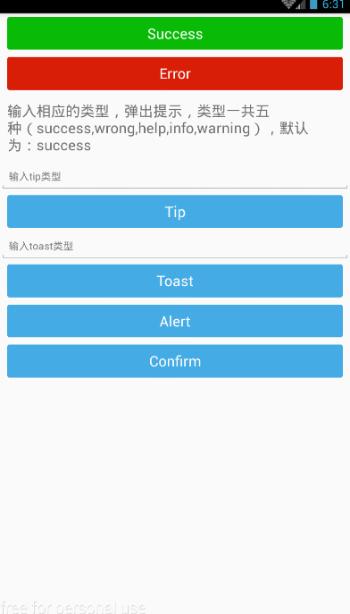

# ReactNativeTips

移动端各类Tips提示组件合集，提供toast，success，error，alert，confirm等。

###效果

##Dev

1.下载项目到本地目录

    git clone https://github.com/BingKui/ReactNativeTips.git

2.安装所需依赖（默认机器已经安装nodejs以及react-native-cli）

    npm install

3.打开模拟器或者连接手机，运行项目

	react-native run-android

或者

	react-native run-ios

##说明

组件提供多种样式，目前类型（type）分为：success,wrong,help,info,warning五种，可根据自己需要添加其他。

##资源

图标：[Alibaba国际站图标库](http://www.iconfont.cn/plus/collections/detail?cid=31 "Alibaba国际站图标库")

参考资料：[ReactNative中文网](http://reactnative.cn/docs/0.39/getting-started.html#content "reactnative中文网")

##联系我

有什么疑问，或者在使用过程中有什么需要改进的，可以联系我。

邮箱：<178974662@qq.com>